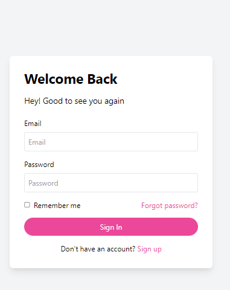
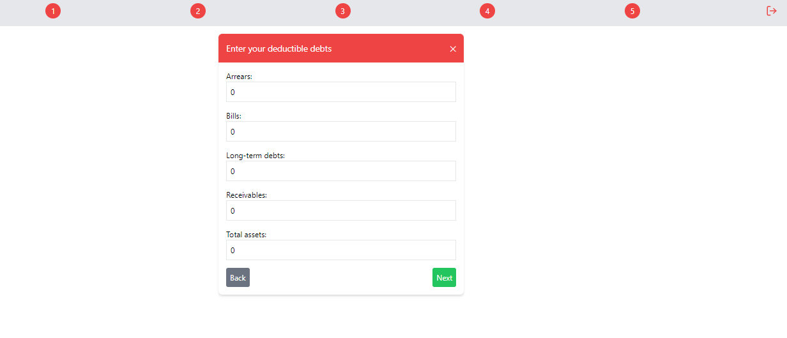
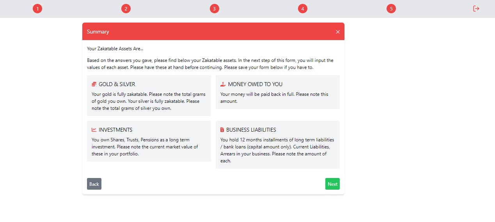
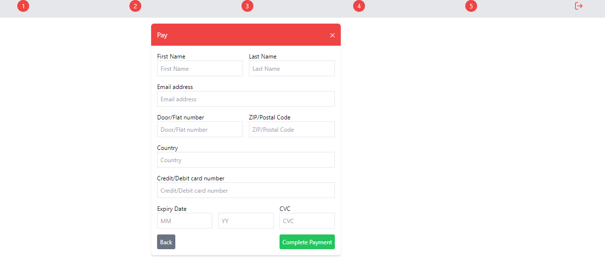
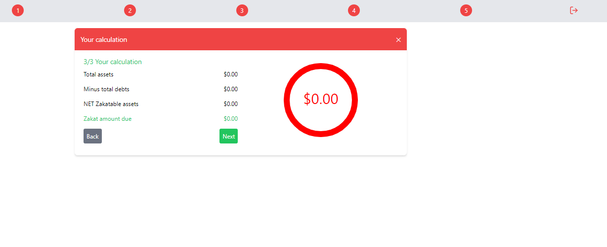

# React & Firebase Zakaat Calculator App

A simple and intuitive Zakaat Calculator application built with React for the frontend and Firebase for the backend. This project demonstrates how to sign up, sign in, and calculate Zakaat using mock data and Firebase for user authentication.

## Features

- **User Authentication**: Sign up and login using Firebase Authentication.
- **Zakaat Calculation**: Calculate your Zakaat with an easy-to-use form.
- **Responsive Design**: Works on both desktop and mobile devices.
- **github pages**:  deployment and access.

## Technologies Used

- **React**: A JavaScript library for building user interfaces.
- **Firebase**:
  - **Authentication**: For user sign-up and login.
  - **Firestore**: For storing and managing user data.
  - **Hosting**: For deploying the application.
- **React Router**: For navigation between different pages.
- **Tailwind CSS**: For styling the application.

## Screenshots

### get started  Screen


### Sign In Screen



### Sign Up Page


### step 2  Page



### step3 Page



### step 4 Page




### step 5  Page



## Demo

Check out the live demo of the app here: [Live Demo](https://mohashafici.github.io/zakaat-calculator/)

## Getting Started

Follow these instructions to set up the project locally.

### Prerequisites

- Node.js and npm installed
- Firebase account

### Installation

1. **Clone the repository**:
   ```bash
   git clone https://github.com/mohashafici/zakaat-calculator.git
   cd zakaat-calculator
